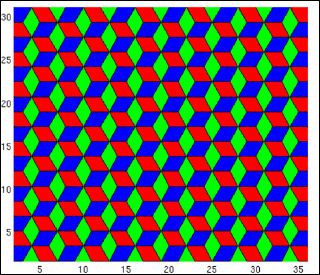

# MIT-OCW-18.06SC-Linear-Algebra-Fall-2011

My coursework for MIT OCW 18.06SC Linear Algebra Fall 2011 class.

All solutions are my own.

Because the Scholar (SC) version of the course was taken, the coursework is organized into Sessions and Exams. Each includes the problem statements alongside my handwritten solutions.

Taught by [Prof. Gilbert Strang](https://ocw.mit.edu/search/?q=Prof.+Gilbert+Strang) and Recitation Instructors Martina Balagovic, Linan Chen, Benjamin Harris, Ana Rita Pires and David Shirokoff.

Course Link: https://ocw.mit.edu/courses/18-06sc-linear-algebra-fall-2011/

## Topics Covered

| Topic | Subtopics |
|-------|-----------|
| Ax = b and the Four Subspaces | Geometry of linear equations, matrix elimination, inverse matrices, LU factorization, vector spaces, column space, nullspace, basis, dimension, fundamental subspaces |
| Least Squares, Determinants and Eigenvalues | Orthogonal vectors, projections, least squares, Gram-Schmidt process, determinant properties, eigenvalues, diagonalization, differential equations, Markov matrices |
| Positive Definite Matrices and Applications | Symmetric matrices, complex matrices, FFT, positive definiteness, Jordan form, singular value decomposition, linear transformations, basis changes, image compression, pseudoinverses |

## Coursework

| Type | Count |
|------|-------|
| Sessions | 31 |
| Exams | 3 |
| Final Exam | 1 |

## Transcript

| Assessment | Grade |
|------------|-------|
| [Exam 1](./Exam%201) | 88/100* |
| [Exam 2](./Exam%202) | 94/100* |
| [Exam 3](./Exam%203) | 80/100* |
| [Final Exam](./Final%20Exam) | 93/100* |

\*Exams were not graded at the time of completion (~2024). To be more precise, they were graded in 2026 using Claude Opus 4.6 with extended thinking enabled, cross-referenced with the official solutions.

## My Other MIT Coursework

[18.01SC Single Variable Calculus](https://github.com/BenyaminJazayeri/MIT-OCW-18.01SC-Single-Variable-Calculus-Fall-2010) · [18.02SC Multivariable Calculus](https://github.com/BenyaminJazayeri/MIT-OCW-18.02SC-Multivariable-Calculus-Fall-2010) · [6.0001 Intro to CS & Programming in Python](https://github.com/BenyaminJazayeri/MIT-OCW-6.0001-Introduction-To-Computer-Science-And-Programming-In-Python-Fall-2016) · [6.0002 Intro to Computational Thinking & Data Science](https://github.com/BenyaminJazayeri/MIT-OCW-6.0002-Introduction-To-Computational-Thinking-And-Data-Science-Fall-2016) · [6.006 Introduction to Algorithms](https://github.com/BenyaminJazayeri/MIT-OCW-6.006-Introduction-To-Algorithms-Fall-2011) · [6.034 Artificial Intelligence](https://github.com/BenyaminJazayeri/MIT-OCW-6.034-Artificial-Intelligence-Fall-2010) · [6.036 Introduction to Machine Learning](https://github.com/BenyaminJazayeri/MIT-Open-Learning-6.036-Introduction-To-Machine-Learning-Spring-2019) · [6.042J Mathematics for Computer Science](https://github.com/BenyaminJazayeri/MIT-OCW-6.042J-Mathematics-For-Computer-Science-Fall-2010)

I'd be very happy to discuss anything related to MIT OCW. Reach me at [benjamin.jazayeri@gmail.com](mailto:benjamin.jazayeri@gmail.com).
